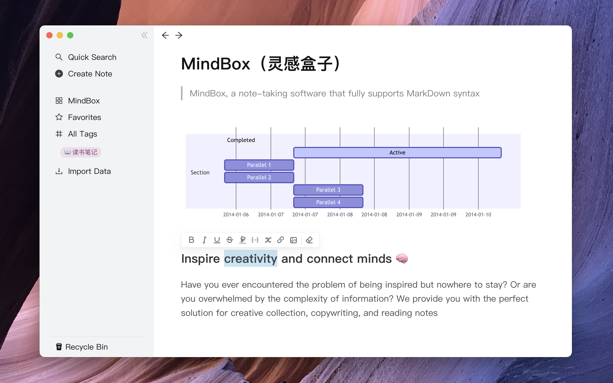

## MindBox(灵感盒子)📝

> MindBox, a note-taking software that fully supports MarkDown syntax

### Inspire creativity and connect minds 🧠

Have you ever encountered the problem of being inspired but nowhere to stay? Or are you overwhelmed by the complexity of information? We provide you with the perfect solution for creative collection, copywriting, and reading notes

### Intelligent AI(Under development)📚 

Not only is it a simple note-taking software, it also incorporates advanced artificial intelligence features. Our intelligent AI assistant will help you easily organize your notes and make deep connections within them, forming your personal knowledge brain map. Whether it is knowledge points, opinions or creative thinking, you can quickly search, greatly improving your thinking ability and creative efficiency

### Data is stored locally, safe and reliable

MindBox is a native software that puts your data in local database. Your inspiration will be stored locally on your device, absolutely safe and secure, without any risk of privacy leakage. Whether it's private, commercial, or academic content, you can trust them to the MindBox with confidence.
